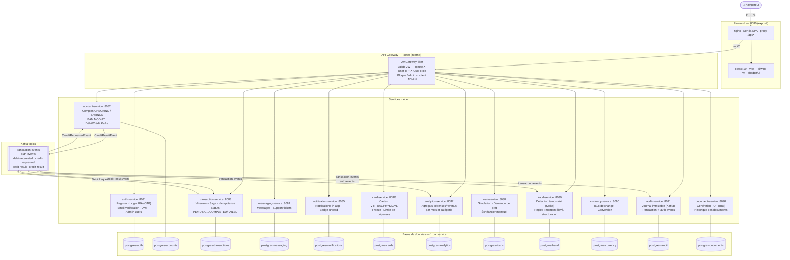
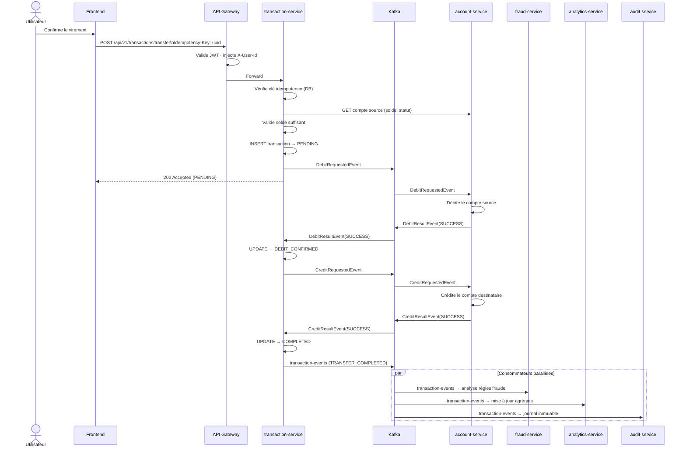

# Solaris Bank — Banking Platform

Plateforme bancaire complète construite sur une architecture microservices.
Projet d'apprentissage couvrant Spring Boot 4, Kafka (Saga pattern), JWT 2FA, RBAC et React 19.

---

## CI/CD & Couverture

| Service | Build | Couverture |
|---|---|---|
| api-gateway |  |  |
| auth-service |  |  |
| account-service |  |  |
| transaction-service |  |  |
| messaging-service |  |  |
| notification-service |  |  |
| card-service |  |  |
| analytics-service |  |  |
| loan-service |  |  |
| fraud-service |  |  |
| currency-service |  |  |
| audit-service |  |  |
| document-service |  |  |

---

## Table des matières

- [Architecture](#architecture)
- [Flux de virement — Saga Kafka](#flux-de-virement--saga-kafka)
- [Sécurité](#sécurité)
  - [Authentification 2FA](#authentification-2fa)
  - [Rôles & Autorisation](#rôles--autorisation)
  - [Sécurité inter-services](#sécurité-inter-services)
  - [Idempotence des transactions](#idempotence-des-transactions)
- [Services](#services)
- [Lancer le projet](#lancer-le-projet)
- [API Reference](#api-reference)
- [Structure du projet](#structure-du-projet)
- [Stack technique](#stack-technique)

---

## Architecture



### Principes d'architecture

- **Un service = une responsabilité** — chaque service gère un domaine métier isolé
- **Une base de données par service** — aucune jointure cross-service, aucune base partagée
- **Défense en profondeur** — le gateway valide le JWT et injecte les headers ; chaque service backend les re-valide via `InternalRequestFilter`
- **Stateless** — aucune session serveur, authentification uniquement par JWT court-lived (24h) + refresh token (7j)
- **Event-driven** — analytics, fraude et audit consomment les événements Kafka de manière découplée, sans ralentir le chemin critique des virements

---

## Flux de virement — Saga Kafka

Quand un utilisateur effectue un virement, la transaction passe par une saga orchestrée via Kafka. Le frontend reçoit immédiatement un `202 Accepted` avec le statut `PENDING`, puis le solde est mis à jour de manière asynchrone. En parallèle, `fraud-service` et `analytics-service` consomment le même événement Kafka.



> **Idempotence** : chaque soumission génère un UUID unique (`Idempotency-Key`). En cas de rejeu (double-clic, timeout réseau), le serveur retourne la transaction existante sans doublon. La contrainte `UNIQUE` en base garantit ce comportement même sous charge concurrente.

> **État intermédiaire `DEBIT_CONFIRMED`** : avant de publier `CreditRequestedEvent`, la transaction passe en `DEBIT_CONFIRMED`. Si Kafka est indisponible, `@Transactional` annule la mise à jour — la transaction reste `PENDING` et le message sera relivré. Ce verrou d'état empêche également un `DebitResult` redélivré de déclencher un second crédit.

---

## Sécurité

### Authentification 2FA

La connexion se fait en **deux étapes** :

```
1. POST /login     → identifiants valides
                     → OTP 6 chiffres envoyé par email
                     → retourne un sessionToken opaque (pas de JWT)

2. POST /verify-otp → sessionToken + code OTP
                     → JWT access token (24h) + refresh token (7j, HttpOnly cookie)
```

| Paramètre | Valeur |
|---|---|
| Durée OTP | 10 minutes |
| Tentatives max | 3 (puis session invalidée) |
| Algorithme | HMAC-SHA256 du code stocké en base |
| Lockout progressif | Délai croissant après trop d'échecs de login |

### Rôles & Autorisation

| Couche | Mécanisme |
|---|---|
| **Transport** | HTTPS (TLS) via reverse proxy |
| **Identité** | JWT signé HMAC-SHA256, durée 24h |
| **Mots de passe** | BCrypt (coût par défaut) |
| **Rôles** | `CLIENT` / `ADMIN` — claim `role` dans le JWT |
| **Email** | Vérification obligatoire à l'inscription (token UUID, expiration 24h) |

**Protection des routes admin (3 couches) :**

```
Requête → [1] AdminRoute (React)  →  [2] JwtGatewayFilter  →  [3] Controller
              Redirige /admin          403 si role ≠ ADMIN       Valide X-User-Role
              si role ≠ ADMIN          avant tout routage         (défense en profondeur)
```

- Les comptes `ADMIN` ne peuvent pas accéder au portail client (`ProtectedRoute` les renvoie vers `/admin`)
- L'inscription publique crée toujours un compte `CLIENT` — impossible de s'auto-promouvoir
- Le compte admin initial est créé par `DataInitializer` au démarrage via `ADMIN_EMAIL` / `ADMIN_PASSWORD`

**Changement d'email (3 étapes) :**

```
1. POST /request-email-change   → OTP envoyé sur l'email actuel (preuve de possession)
2. POST /confirm-email-change-otp → OTP validé → lien de confirmation vers le nouvel email
3. GET  /verify-new-email?token=... → clic depuis la nouvelle boîte → email mis à jour
```

### Sécurité inter-services

Deux secrets distincts protègent les deux types de communication :

| Secret | Utilisé par | Rôle |
|---|---|---|
| `JWT_SECRET` | `auth-service` (signe) · `api-gateway` (vérifie) | Authentifie les **utilisateurs** |
| `INTERNAL_SECRET` | Tous les services backend | Authentifie les **appels inter-services** |

Chaque service expose un `InternalRequestFilter` qui exige sur toutes les requêtes soit un `X-User-Id` valide (injecté par l'API Gateway), soit le header `X-Internal-Secret` (appels service-à-service). Exemple : lors d'une compensation de saga, `transaction-service` appelle directement `account-service` avec ce header sans passer par le gateway.

### Idempotence des transactions

Chaque virement porte un `Idempotency-Key` (UUID généré côté client) :
- **Même clé** → le serveur retourne la transaction existante (pas de doublon)
- **Succès** → nouvelle clé générée pour le prochain virement
- **Échec** → même clé conservée (le retry est sûr)

---

## Services

### API Gateway — `:8080`
Point d'entrée unique. Valide le JWT, injecte `X-User-Id` et `X-User-Role` dans chaque requête en aval. Bloque `/api/v1/admin/**` pour tout token avec `role ≠ ADMIN`.

Routes publiques (sans JWT) : `POST /auth/login`, `POST /auth/register`, `POST /auth/verify-otp`, `GET /auth/verify-email`, `POST /auth/resend-verification`, `POST /auth/forgot-password`, `POST /auth/reset-password`, `GET /auth/verify-new-email`.

### auth-service — `:8081`
- Inscription avec validation stricte (maj, min, chiffre, caractère spécial, 8 car. min)
- **Vérification email** : token UUID envoyé par email (expiration 24h) — la connexion est bloquée tant que l'email n'est pas confirmé
- **Login 2FA** : OTP 6 chiffres par email, 10 min, 3 tentatives max, lockout progressif
- **Changement d'email sécurisé** : flux en 3 étapes avec double vérification (OTP ancien email + lien nouvel email)
- **Changement de mot de passe** : exige le mot de passe actuel, invalide la session
- Refresh token via HttpOnly cookie, révocation à la déconnexion
- `DataInitializer` : seede le compte admin au démarrage (pré-vérifié, sans email)
- Endpoints admin : liste des utilisateurs, activation / désactivation, nettoyage des tokens expirés

### account-service — `:8082`
- Création de compte `CHECKING` (courant) ou `SAVINGS` (épargne) par utilisateur
- Génération d'IBAN français valide (algorithme MOD-97)
- Opérations de débit/crédit consommées depuis Kafka (saga)
- KYC : statut de soumission du dossier utilisateur
- Endpoints admin : liste de tous les comptes, blocage / déblocage

### transaction-service — `:8083`
- Virements asynchrones via Saga Kafka (4 états : `PENDING` → `DEBIT_CONFIRMED` → `COMPLETED` / `FAILED`)
- Clé d'idempotence (contrainte unique en base)
- Historique paginé par compte
- Publication d'événements `transaction-events` consommés par analytics, fraud et audit
- Endpoints admin : vue globale de toutes les transactions

### messaging-service — `:8084`
- Messages internes entre utilisateurs et support
- Support tickets avec gestion des demandes
- Compteur de messages non lus (badge frontend)
- Endpoints admin : vue globale des conversations et demandes

### notification-service — `:8085`
- Notifications in-app (événements côté serveur)
- Compteur de non-lus (`/unread-count`) pour le badge frontend
- Marquage lu individuel ou en masse
- `InternalRequestFilter` pour les appels depuis d'autres services

### card-service — `:8086`
- Cartes `VIRTUAL` et `PHYSICAL` liées à un compte
- Génération sécurisée du numéro de carte (stocké hashé, exposé masqué `****-****-****-XXXX`)
- Expiration générée automatiquement (3 ans), CVV hashé
- Actions : **freeze**, **unfreeze**, **annuler**, **modifier la limite de dépenses**
- Une carte annulée ne peut pas être réactivée

### analytics-service — `:8087`
- Consomme `transaction-events` depuis Kafka (TRANSFER_COMPLETED, DEBIT, CREDIT)
- Agrège les dépenses et revenus par **utilisateur / compte / mois / catégorie** (`SpendingAggregate`)
- Endpoints : dépenses du mois courant (avec répartition par catégorie), historique multi-mois
- Mise à jour incrémentale en temps réel — aucun calcul à la demande

### loan-service — `:8088`
- **Simulation** : calcule mensualité, taux et coût total sans créer de dossier
- **Demande** : soumission d'un prêt avec durée, montant et compte de versement
- Statuts : `PENDING` → `APPROVED` / `REJECTED`
- Endpoints admin : liste et gestion des demandes de prêt

### fraud-service — `:8089`
- Consomme `transaction-events` depuis Kafka en temps réel
- **Règle 1 — Montant élevé** : alerte si montant > 10 000 € (score 75)
- **Règle 2 — Structuration** : alerte si montant > 5 000 € et multiple de 1 000 € (+20 pts)
- Score cumulatif plafonné à 100
- Statuts d'alerte : `OPEN` → `RESOLVED` / `FALSE_POSITIVE`
- Endpoints : alertes de l'utilisateur connecté ; admin : toutes les alertes ouvertes + résolution

### currency-service — `:8090`
- Taux de change stockés en base (mise à jour manuelle via endpoint admin)
- Conversion entre devises avec taux croisés
- Endpoint public : taux depuis une devise de base (défaut EUR)
- Conversion : `from` + `to` + `amount` → résultat

### audit-service — `:8091`
- Journal d'audit **immuable** alimenté exclusivement par Kafka
- Consomme `transaction-events` (source : transaction-service) et `auth-events` (source : auth-service)
- Stocke : type d'événement, source, userId, entityType, entityId, payload JSON brut, timestamp
- Endpoints : événements de l'utilisateur connecté (paginé) ; admin : tous les événements filtrables par type

### document-service — `:8092`
- Génération de **RIB en PDF** à la demande (iText / PDFBox)
- Récupère les coordonnées bancaires depuis `account-service` via `X-Internal-Secret`
- Historique des documents générés par utilisateur
- Le PDF est servi en téléchargement direct (`Content-Disposition: attachment`)

---

## Lancer le projet

### Développement local

**Prérequis** : Java 21, Docker Desktop

```bash
# 1. Infrastructure (PostgreSQL × 12 + Kafka)
cd infrastructure
docker compose up -d

# 2. Lancer les services (un terminal par service, ou via IDE)
cd services/auth-service        && ./mvnw spring-boot:run   # :8081
cd services/account-service     && ./mvnw spring-boot:run   # :8082
cd services/transaction-service && ./mvnw spring-boot:run   # :8083
cd services/api-gateway         && ./mvnw spring-boot:run   # :8080
# ... idem pour les autres services

# 3. Frontend
cd frontend && npm install && npm run dev   # http://localhost:5173
```

**Compte admin en local** — ajouter dans `services/auth-service/src/main/resources/application.properties` :
```properties
admin.email=admin@solaris.bank
admin.password=TonMotDePasse123!
```
Redémarrer `auth-service`, puis supprimer ces lignes (ne pas committer).

**Email / OTP en local** — si `SMTP_USERNAME` / `SMTP_PASSWORD` ne sont pas définis, les emails échouent silencieusement et l'URL / le code OTP sont loggés dans la console :
```
[EmailService] SMTP not configured — OTP for user jean@solaris.com: 482916
[EmailService] SMTP not configured — verification URL: http://localhost:5173/verify-email?token=<uuid>
```

### Production (Docker Compose)

Les images sont construites et poussées vers GHCR par GitHub Actions à chaque push sur `main`. Le déploiement sur le NAS est **entièrement automatisé** — les secrets sont transmis depuis GitHub Secrets directement à `docker compose`, aucun fichier `.env` n'est nécessaire sur le serveur.

**Secrets à configurer dans GitHub** *(Settings → Secrets and variables → Actions)* :

| Secret | Description | Génération |
|---|---|---|
| `JWT_SECRET` | Clé de signature JWT (HMAC-SHA256) | `openssl rand -base64 32` |
| `INTERNAL_SECRET` | Secret inter-services | `openssl rand -hex 32` |
| `NAS_HOST` | IP ou hostname du NAS | — |
| `NAS_USER` | Utilisateur SSH | — |
| `NAS_SSH_KEY` | Clé privée SSH (PEM) | — |
| `NAS_PORT` | Port SSH (défaut 22) | — |
| `NAS_DEPLOY_PATH` | Chemin absolu sur le NAS | — |
| `GHCR_TOKEN` | GitHub PAT `read:packages` | — |
| `ADMIN_EMAIL` | Email du compte admin initial | — |
| `ADMIN_PASSWORD` | Mot de passe admin (fort) | — |
| `SMTP_USERNAME` | Login SMTP (Brevo) | — |
| `SMTP_PASSWORD` | Clé SMTP Brevo | — |
| `SMTP_FROM` | Adresse expéditeur | — |
| `FRONTEND_URL` | URL publique du frontend | — |

Seul le port **8080** est exposé (nginx frontend). L'api-gateway et les microservices sont internes au réseau Docker.

> **Déploiement manuel** : les mêmes variables peuvent être définies dans un fichier `.env` aux côtés de `docker-compose.prod.yml`, puis `docker compose -f docker-compose.prod.yml up -d`.

**Configuration SMTP (Brevo) :**
```
SMTP_HOST=smtp-relay.brevo.com
SMTP_PORT=587
SMTP_USERNAME=<ton_email_brevo>
SMTP_PASSWORD=<clé_smtp_brevo>
SMTP_FROM=noreply@ton-domaine.fr
FRONTEND_URL=https://ton-domaine.fr
```
Pour éviter le spam, authentifier le domaine dans Brevo (DKIM + DMARC).

---

## API Reference

Toutes les requêtes passent par le gateway sur le port **8080**.
Les routes protégées nécessitent `Authorization: Bearer <token>`.

### Auth

```bash
# Inscription
POST /api/v1/auth/register
{ "firstname": "Jean", "lastname": "Dupont", "email": "jean@solaris.com", "password": "Pass@123" }
# → 201 { "message": "Account created successfully", "userId": "uuid" }

# Étape 1 — connexion (retourne un sessionToken, PAS de JWT)
POST /api/v1/auth/login
{ "email": "jean@solaris.com", "password": "Pass@123" }
# → 200 { "sessionToken": "uuid" }   (OTP envoyé par email)

# Étape 2 — vérification OTP (retourne le JWT)
POST /api/v1/auth/verify-otp
{ "sessionToken": "uuid", "code": "482916" }
# → 200 { "accessToken": "eyJ...", "role": "CLIENT" }

# Renvoyer l'OTP
POST /api/v1/auth/resend-otp
{ "sessionToken": "uuid" }

# Vérification de l'email (lien reçu par mail)
GET /api/v1/auth/verify-email?token=<uuid>
# → 200 OK | 404 invalide | 410 expiré

# Renvoyer l'email de vérification
POST /api/v1/auth/resend-verification
{ "email": "jean@solaris.com" }

# Refresh token
POST /api/v1/auth/refresh   (cookie HttpOnly)

# Déconnexion (révoque le refresh token)
POST /api/v1/auth/logout

# Changer de mot de passe
POST /api/v1/auth/change-password
{ "currentPassword": "...", "newPassword": "..." }

# Changer d'email — étape 1 : OTP sur l'email actuel
POST /api/v1/auth/request-email-change
{ "newEmail": "nouveau@exemple.com", "currentPassword": "..." }

# Changer d'email — étape 2 : valider l'OTP
POST /api/v1/auth/confirm-email-change-otp
{ "code": "123456" }

# Changer d'email — étape 3 : clic sur le lien dans la nouvelle boîte
GET /api/v1/auth/verify-new-email?token=<uuid>

# Mot de passe oublié
POST /api/v1/auth/forgot-password  { "email": "..." }
POST /api/v1/auth/reset-password   { "token": "...", "newPassword": "..." }
```

### Comptes

```bash
POST   /api/v1/accounts              # Créer { "type": "CHECKING" | "SAVINGS" }
GET    /api/v1/accounts              # Mes comptes
GET    /api/v1/accounts/{id}         # Détail
GET    /api/v1/accounts/kyc/status   # Statut KYC
POST   /api/v1/accounts/kyc/submit   # Soumettre le dossier KYC
```

### Transactions

```bash
POST /api/v1/transactions/transfer
     Idempotency-Key: <uuid>
     { "fromAccountId": "uuid", "toAccountId": "uuid", "amount": 100.00 }
# → 202 Accepted (PENDING, traitement asynchrone)

GET  /api/v1/transactions?accountId=<uuid>&page=0&size=20
GET  /api/v1/transactions/{id}
```

### Cartes

```bash
POST   /api/v1/cards                   # Créer { "accountId": "uuid", "cardType": "VIRTUAL" }
GET    /api/v1/cards                   # Mes cartes
POST   /api/v1/cards/{id}/freeze       # Geler
POST   /api/v1/cards/{id}/unfreeze     # Dégeler
PUT    /api/v1/cards/{id}/limit        # { "limit": 500.00 }
DELETE /api/v1/cards/{id}              # Annuler définitivement
```

### Prêts

```bash
POST /api/v1/loans/simulate
     { "amount": 10000, "durationMonths": 36 }
# → { "monthlyPayment": 302.11, "totalCost": 10875.96, "annualRate": 5.5 }

POST /api/v1/loans                     # Soumettre une demande
GET  /api/v1/loans                     # Mes prêts
```

### Analytique

```bash
GET /api/v1/analytics/spending/monthly?year=2026&month=6
# → agrégats par catégorie pour le mois donné

GET /api/v1/analytics/spending/history
# → historique multi-mois (year, month, totalDebit, totalCredit, txCount)
```

### Fraude

```bash
GET /api/v1/fraud/alerts               # Mes alertes de fraude
```

### Devises

```bash
GET /api/v1/currencies/rates?base=EUR   # Taux depuis une devise de base
GET /api/v1/currencies/convert?from=EUR&to=USD&amount=100
```

### Audit

```bash
GET /api/v1/audit/my-events?page=0&size=20   # Mon journal d'audit
```

### Documents

```bash
GET /api/v1/documents/rib/{accountId}   # Télécharger le RIB PDF
GET /api/v1/documents/history           # Historique des documents générés
```

### Notifications

```bash
GET   /api/v1/notifications?page=0&size=20    # Mes notifications
GET   /api/v1/notifications/unread-count      # { "count": 3 }
PATCH /api/v1/notifications/{id}/read         # Marquer lu
PATCH /api/v1/notifications/read-all          # Tout marquer lu
```

### Admin _(rôle ADMIN requis)_

```bash
# Utilisateurs
GET   /api/v1/admin/users
PATCH /api/v1/admin/users/{id}/status?active=false

# Comptes
GET   /api/v1/admin/accounts?page=0&size=20
PATCH /api/v1/admin/accounts/{id}/status?status=BLOCKED

# Transactions
GET   /api/v1/admin/transactions?page=0&size=20

# Fraude
GET  /api/v1/admin/fraud/alerts
POST /api/v1/admin/fraud/alerts/{id}/resolve
     { "resolution": "FALSE_POSITIVE" | "RESOLVED", "note": "..." }

# Prêts
GET   /api/v1/admin/loans
PATCH /api/v1/admin/loans/{id}/status?status=APPROVED

# Devises
PUT /api/v1/currencies/admin/rates
    { "base": "EUR", "target": "USD", "rate": 1.085 }

# Audit
GET /api/v1/admin/audit/events?eventType=TRANSACTION&page=0&size=50
```

### Codes HTTP

| Code | Signification |
|---|---|
| `200` | OK |
| `201` | Ressource créée |
| `202` | Accepté (traitement asynchrone en cours) |
| `204` | Succès sans contenu |
| `400` | Validation échouée (champ manquant, format invalide) |
| `401` | Token absent, expiré, OTP incorrect ou identifiants invalides |
| `403` | Accès refusé (ressource d'un autre utilisateur, rôle insuffisant, email non vérifié) |
| `404` | Ressource introuvable |
| `409` | Conflit (email déjà utilisé, doublon) |
| `410` | Token expiré (OTP, lien de vérification) |
| `500` | Erreur serveur inattendue |

---

## Structure du projet

```
banking-platform/
├── .github/
│   ├── workflows/
│   │   ├── build.yml          # CI — 13 services + frontend en parallèle, badges de couverture
│   │   └── deploy.yml         # CD — push GHCR + SSH deploy sur TrueNAS
│   └── badges/                # SVG de couverture générés automatiquement
│
├── services/
│   ├── api-gateway/           # :8080 — JWT filter, routing, proxy
│   ├── auth-service/          # :8081 — register, login 2FA, email, JWT, admin users
│   ├── account-service/       # :8082 — comptes IBAN, Kafka consumer débit/crédit
│   ├── transaction-service/   # :8083 — virements Saga, idempotence
│   ├── messaging-service/     # :8084 — messages, support tickets
│   ├── notification-service/  # :8085 — notifications in-app
│   ├── card-service/          # :8086 — cartes, freeze, limite
│   ├── analytics-service/     # :8087 — agrégats dépenses/revenus (Kafka)
│   ├── loan-service/          # :8088 — simulation et demande de prêt
│   ├── fraud-service/         # :8089 — détection fraude temps réel (Kafka)
│   ├── currency-service/      # :8090 — taux de change, conversion
│   ├── audit-service/         # :8091 — journal immuable (Kafka)
│   └── document-service/      # :8092 — génération PDF (RIB)
│
├── frontend/
│   ├── src/
│   │   ├── components/        # Layout, Navbar, AdminLayout, ProtectedRoute, AdminRoute…
│   │   ├── pages/             # LoginPage, OtpVerificationPage, DashboardPage…
│   │   │   └── admin/         # AdminDashboardPage, AdminUsersPage…
│   │   ├── lib/               # api.ts (Axios + interceptors), auth.ts (JWT decode)
│   │   └── types/             # Interfaces TypeScript partagées
│   ├── nginx.conf             # SPA + proxy /api/* → api-gateway
│   └── Dockerfile             # Multi-stage : node build → nginx
│
└── infrastructure/
    ├── docker-compose.yml      # Local : PostgreSQL × 12 + Kafka (KRaft)
    └── docker-compose.prod.yml # Production : stack complète (images GHCR)
```

---

## Stack technique

| Couche | Technologie |
|---|---|
| Langage backend | Java 21 |
| Framework | Spring Boot 4.x |
| Sécurité | Spring Security · JJWT 0.12 · BCrypt |
| Persistance | Spring Data JPA · Hibernate · PostgreSQL 16 |
| Migrations | Flyway |
| Messaging | Apache Kafka (KRaft, sans ZooKeeper) |
| Frontend | React 19 · Vite · TypeScript |
| UI | Tailwind CSS v4 · shadcn/ui · Lucide Icons |
| HTTP client | Axios · TanStack Query v5 |
| Formulaires | React Hook Form · Zod |
| PDF | iText / PDFBox (document-service) |
| Emails transactionnels | Spring Mail · Brevo SMTP (STARTTLS) |
| Conteneurisation | Docker · Docker Compose |
| CI/CD | GitHub Actions · GHCR |
| Déploiement | TrueNAS Scale (VM) · nginx reverse proxy |
| Tests | JUnit 5 · Mockito · Spring Boot Test · H2 |

---

## Contribution

Ce repo constitue un projet personnel d'entraînement à la conception, au design et à l'implémentation d'une application web bancaire.

Aucune contribution n'est attendue.
