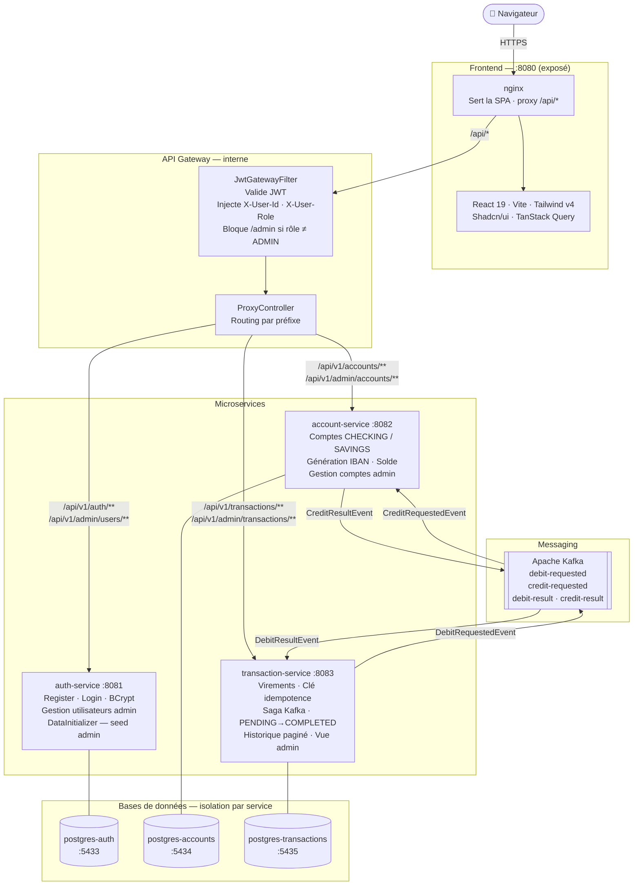
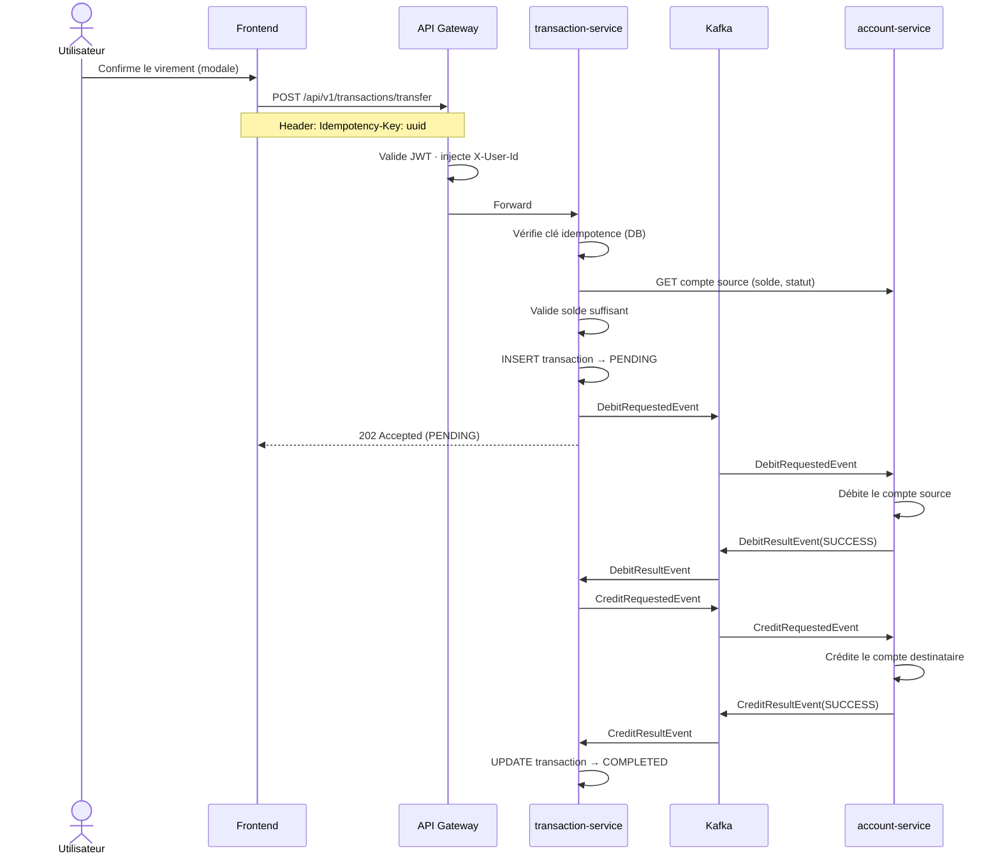

# Solaris Bank — Banking Platform

Plateforme bancaire complète construite sur une architecture microservices.
Projet d'apprentissage couvrant Spring Boot, Kafka (Saga pattern), JWT, RBAC et React.

---

## CI/CD & Couverture

| Service | Build | Couverture |
|---|---|---|
| api-gateway |  |  |
| auth-service |  |  |
| account-service |  |  |
| transaction-service |  |  |

---

## Table des matières

- [Architecture](#architecture)
- [Flux de virement — Saga Kafka](#flux-de-virement--saga-kafka)
- [Sécurité](#sécurité)
- [Services](#services)
- [Lancer le projet](#lancer-le-projet)
- [API Reference](#api-reference)
- [Structure du projet](#structure-du-projet)
- [Stack technique](#stack-technique)
- [Vérification email](#vérification-email)

---

## Architecture



### Principes d'architecture

- **Un service = une responsabilité** — chaque service gère son propre domaine métier
- **Une base de données par service** — pas de base partagée, pas de jointures cross-service
- **Sécurité centralisée + défense en profondeur** — le gateway valide le JWT et injecte les headers ; chaque service les re-valide indépendamment
- **Stateless** — aucune session serveur, authentification uniquement par JWT
- **Async par défaut** — les virements passent par Kafka (Saga pattern) pour la fiabilité et la résilience

---

## Flux de virement — Saga Kafka

Quand un utilisateur effectue un virement, la transaction passe par une saga orchestrée via Kafka. Le frontend reçoit immédiatement un `202 Accepted` avec le statut `PENDING`, puis le solde est mis à jour de manière asynchrone.



> **Idempotence** : chaque soumission de formulaire génère un UUID unique (`Idempotency-Key`). Si la requête est rejouée (double-clic, timeout réseau), le serveur retourne la transaction existante sans en créer une seconde. La contrainte `UNIQUE` en base garantit ce comportement même sous charge concurrente.

---

## Sécurité

### Authentification & Autorisation

| Couche | Mécanisme |
|---|---|
| **Transport** | HTTPS (TLS) via reverse proxy |
| **Identité** | JWT signé HMAC-SHA256, durée 24h |
| **Mots de passe** | BCrypt (coût par défaut) |
| **Rôles** | `CLIENT` / `ADMIN` — claim `role` dans le JWT |
| **Email** | Vérification obligatoire à l'inscription (token UUID, expiration 24h) |

### Vérification d'email

À chaque inscription, un email de vérification est envoyé via SMTP (Brevo en prod). Le compte reste **inaccessible tant que l'email n'est pas confirmé**.

- **Compatibilité ascendante** : les comptes créés avant l'introduction de cette feature (`emailVerified = NULL`) sont considérés comme vérifiés.
- **Token expiré** : le frontend propose de renvoyer un nouveau lien (le token précédent est invalidé).
- **En développement** : si le SMTP n'est pas configuré, l'URL de vérification est simplement loguée dans la console — aucune exception n'est levée.

### Protection des routes admin (3 couches)

```
Requête → [1] AdminRoute (React)  →  [2] JwtGatewayFilter  →  [3] AdminController
              Redirige /admin          403 si role ≠ ADMIN       Valide X-User-Role
              si role ≠ ADMIN          avant tout routage         (défense en profondeur)
```

- Les comptes `ADMIN` ne peuvent pas accéder au portail client (`ProtectedRoute` les renvoie vers `/admin`)
- L'inscription publique crée toujours un compte `CLIENT` — il est impossible de s'auto-promouvoir
- Le compte admin initial est créé par `DataInitializer` au démarrage, via les variables d'environnement `ADMIN_EMAIL` / `ADMIN_PASSWORD`

### Idempotence des transactions

Chaque virement porte un `Idempotency-Key` (UUID généré côté client). En cas de rejeu :
- **Même clé** → le serveur retourne la transaction existante (pas de doublon)
- **Succès** → nouvelle clé générée pour le prochain virement
- **Échec** → même clé conservée (le retry est sûr)

---

## Services

### API Gateway — `:8080`
Point d'entrée unique. Valide le JWT, injecte `X-User-Id` et `X-User-Role` dans chaque requête en aval. Bloque l'accès à `/api/v1/admin/**` pour tout token avec `role ≠ ADMIN`.

Routes publiques (sans JWT) : `POST /api/v1/auth/login`, `POST /api/v1/auth/register`

### auth-service — `:8081`
- Inscription avec validation stricte du mot de passe (maj, min, chiffre, caractère spécial)
- **Vérification email** : token UUID envoyé par email (Brevo SMTP), expiration 24h — la connexion est bloquée tant que l'email n'est pas confirmé
- Login → access token JWT (24h) + refresh token (7j)
- `DataInitializer` : seede le compte admin au démarrage depuis `ADMIN_EMAIL` / `ADMIN_PASSWORD` (admin pré-vérifié, sans envoi d'email)
- Endpoints admin : liste des utilisateurs, activation / désactivation

### account-service — `:8082`
- Création de compte `CHECKING` ou `SAVINGS`
- Génération d'IBAN français valide (algorithme MOD-97)
- Opérations de débit/crédit (consommateur Kafka)
- Endpoints admin : liste de tous les comptes, blocage / déblocage

### transaction-service — `:8083`
- Virements asynchrones via Saga Kafka
- Clé d'idempotence pour la protection contre les doublons
- Statuts : `PENDING` → `COMPLETED` / `FAILED`
- Historique paginé par compte
- Endpoints admin : vue globale de toutes les transactions

---

## Lancer le projet

### Développement local

**Prérequis** : Java 21, Maven 3.9+, Docker Desktop

```bash
# 1. Démarrer PostgreSQL et Kafka
cd infrastructure
docker compose up -d

# 2. Lancer les services (un terminal par service)
cd services/auth-service        && ./mvnw spring-boot:run
cd services/account-service     && ./mvnw spring-boot:run
cd services/transaction-service && ./mvnw spring-boot:run
cd services/api-gateway         && ./mvnw spring-boot:run

# 3. Lancer le frontend
cd frontend
npm install
npm run dev          # http://localhost:5173 avec proxy → gateway :8080
```

Pour créer le compte admin en local, ajoute dans `services/auth-service/src/main/resources/application.properties` :
```properties
admin.email=admin@solaris.bank
admin.password=TonMotDePasse123!
```
Puis redémarre `auth-service`. Supprime ces lignes ensuite (ne pas committer).

**Vérification email en local** : si `SMTP_USERNAME` / `SMTP_PASSWORD` ne sont pas définis, l'envoi d'email échoue silencieusement et l'URL de vérification est loguée directement dans la console de `auth-service` :
```
[EmailService] SMTP not configured — verification URL: http://localhost:5173/verify-email?token=<uuid>
```
Colle l'URL dans ton navigateur pour vérifier le compte sans SMTP.

### Production (Docker Compose)

Les images sont construites et poussées vers GHCR par GitHub Actions à chaque push sur `main`.

```bash
# Sur le serveur — créer le fichier .env
cat > .env <<EOF
DB_PASSWORD=<mot_de_passe_fort>
JWT_SECRET=<clé_base64_256_bits>
JWT_EXPIRATION=86400000
JWT_REFRESH_EXPIRATION=604800000
ADMIN_EMAIL=admin@solaris.bank
ADMIN_PASSWORD=<mot_de_passe_fort>

# SMTP (Brevo recommandé)
SMTP_HOST=smtp-relay.brevo.com
SMTP_PORT=587
SMTP_USERNAME=<ton_email_brevo>
SMTP_PASSWORD=<clé_smtp_brevo>
SMTP_FROM=noreply@solaris-bank.fr

# URL publique du frontend (utilisée dans les liens des emails)
FRONTEND_URL=https://ton-domaine.fr
EOF

# Démarrer la stack
docker compose -f docker-compose.prod.yml up -d
```

Seul le port **8080** est exposé (nginx frontend). L'api-gateway et les microservices sont internes au réseau Docker.

---

## API Reference

Toutes les requêtes passent par le gateway sur le port **8080**.  
Les routes protégées nécessitent `Authorization: Bearer <token>`.

### Auth

```bash
# Inscription — envoie un email de vérification
POST /api/v1/auth/register
{ "firstname": "Jean", "lastname": "Dupont", "email": "jean@solaris.com", "password": "Pass@123" }
# → 201 { "message": "Account created successfully", "userId": "uuid..." }

# Connexion (403 si email non vérifié)
POST /api/v1/auth/login
{ "email": "jean@solaris.com", "password": "Pass@123" }
# → 200 { "accessToken": "eyJ...", "refreshToken": "eyJ...", "role": "CLIENT" }

# Vérification de l'email (lien reçu par mail)
GET /api/v1/auth/verify-email?token=<uuid>
# → 200 OK         Email vérifié
# → 404 Not Found  Token invalide
# → 410 Gone       Token expiré (renvoyer un nouveau lien)

# Renvoyer l'email de vérification
POST /api/v1/auth/resend-verification
{ "email": "jean@solaris.com" }
# → 200 OK  Nouveau token envoyé (remplace l'ancien)
```

### Comptes

```bash
POST   /api/v1/accounts              # Créer un compte { "type": "CHECKING" | "SAVINGS" }
GET    /api/v1/accounts              # Lister mes comptes
GET    /api/v1/accounts/{id}         # Détail d'un compte
PUT    /api/v1/accounts/{id}/status  # Changer le statut (?status=BLOCKED)
```

### Transactions

```bash
POST /api/v1/transactions/transfer   # Effectuer un virement
     Idempotency-Key: <uuid>         # Header recommandé
     { "fromAccountId": "uuid", "toAccountId": "uuid", "amount": 100.00 }
# → 202 Accepted (statut PENDING, traitement asynchrone)

GET  /api/v1/transactions?accountId=<uuid>&page=0&size=20  # Historique paginé
GET  /api/v1/transactions/{id}                             # Détail d'une transaction
```

### Admin _(rôle ADMIN requis)_

```bash
GET   /api/v1/admin/users                       # Liste tous les utilisateurs
PATCH /api/v1/admin/users/{id}/status?active=false  # Activer / désactiver
GET   /api/v1/admin/accounts?page=0&size=20     # Tous les comptes
PATCH /api/v1/admin/accounts/{id}/status?status=BLOCKED  # Bloquer / débloquer
GET   /api/v1/admin/transactions?page=0&size=20 # Toutes les transactions
```

### Codes HTTP

| Code | Signification |
|---|---|
| `201` | Ressource créée |
| `202` | Accepté (traitement asynchrone en cours) |
| `400` | Validation échouée (champ manquant, format invalide) |
| `401` | Token absent, expiré ou identifiants incorrects |
| `403` | Accès refusé (ressource d'un autre utilisateur ou rôle insuffisant) |
| `404` | Ressource introuvable |
| `409` | Conflit (email déjà utilisé) |
| `500` | Erreur serveur inattendue |

---

## Structure du projet

```
banking-platform/
├── .github/
│   └── workflows/
│       ├── build.yml          # CI — build, tests, couverture (5 services en parallèle)
│       └── deploy.yml         # CD — push GHCR + SSH deploy sur TrueNAS
│
├── services/
│   ├── api-gateway/           # Spring Boot — JWT filter, proxy HTTP, routing
│   ├── auth-service/          # Spring Boot — register/login, admin users, JWT
│   ├── account-service/       # Spring Boot — comptes IBAN, Kafka consumer
│   └── transaction-service/   # Spring Boot — virements, Saga, idempotence
│
├── frontend/
│   ├── src/
│   │   ├── components/        # Layout, Navbar, AdminLayout, ProtectedRoute, AdminRoute…
│   │   ├── pages/             # LoginPage, DashboardPage, TransferPage…
│   │   │   └── admin/         # AdminDashboardPage, AdminUsersPage…
│   │   ├── lib/               # api.ts (Axios), auth.ts (JWT decode)
│   │   └── types/             # Interfaces TypeScript (Account, Transaction, AdminUser…)
│   ├── nginx.conf             # Sert la SPA + proxy /api/* → api-gateway
│   └── Dockerfile             # Multi-stage : node build → nginx
│
└── infrastructure/
    ├── docker-compose.yml      # Local : PostgreSQL × 3 + Kafka
    └── docker-compose.prod.yml # Production : stack complète (images GHCR)
```

---

## Stack technique

| Couche | Technologie |
|---|---|
| Language backend | Java 21 |
| Framework | Spring Boot 4.x |
| Sécurité | Spring Security · JJWT 0.12 · BCrypt |
| Persistance | Spring Data JPA · Hibernate · PostgreSQL 16 |
| Messaging | Apache Kafka (KRaft, sans ZooKeeper) |
| Frontend | React 19 · Vite 8 · TypeScript 6 |
| UI | Tailwind CSS v4 · shadcn/ui · Lucide |
| HTTP client (FE) | Axios · TanStack Query v5 |
| Formulaires (FE) | React Hook Form v7 · Zod v4 |
| Emails transactionnels | Spring Mail · Brevo SMTP (STARTTLS) |
| Conteneurisation | Docker · Docker Compose |
| CI/CD | GitHub Actions · GHCR |
| Déploiement | TrueNAS Scale (VM) · nginx reverse proxy |
| Build | Maven 3.9 · npm |

## Vérification email

Lors de l'inscription, chaque nouvel utilisateur reçoit un email de confirmation avant de pouvoir se connecter.

### Flux complet

```
1. POST /register        → compte créé (emailVerified=false) + email envoyé
2. Utilisateur clique    → GET /verify-email?token=<uuid>
3. Token valide          → emailVerified=true, accès autorisé
4. Token expiré (>24h)   → 410 Gone → frontend propose de renvoyer un lien
5. POST /resend-verification → nouveau token (24h) envoyé, ancien invalidé
```

### Comportements notables

| Cas | Comportement |
|---|---|
| Email non vérifié → login | `403 Forbidden` — "Email not verified. Please check your inbox." |
| Token expiré | `410 Gone` — le frontend affiche un bouton "Renvoyer le lien" |
| Token invalide / déjà utilisé | `404 Not Found` |
| Compte admin (créé par DataInitializer) | Pré-vérifié — aucun email envoyé |
| Utilisateurs existants (avant la feature) | `emailVerified = NULL` → traité comme vérifié (compatibilité ascendante) |
| SMTP non configuré (dev) | URL de vérification loguée dans la console, aucune exception |

### Configuration SMTP (Brevo)

Le service utilise [Brevo](https://brevo.com) comme fournisseur SMTP par défaut. Les variables d'environnement à définir en production :

```
SMTP_HOST=smtp-relay.brevo.com
SMTP_PORT=587
SMTP_USERNAME=<ton_email_brevo>
SMTP_PASSWORD=<clé_smtp_brevo>   # Générer dans Brevo → SMTP & API → Clés SMTP
SMTP_FROM=noreply@ton-domaine.fr
FRONTEND_URL=https://ton-domaine.fr
```

Pour que les emails arrivent en boîte principale et non en spam, il est recommandé d'authentifier le domaine d'envoi dans Brevo (enregistrements DKIM + DMARC dans le DNS).

---

## Contribution

Ce repo constitue un projet personnel d'entrainement à la conception, au design et à l'implémentation d'une application web de bank.

Aucune contribution n'est attendue.

